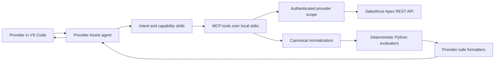
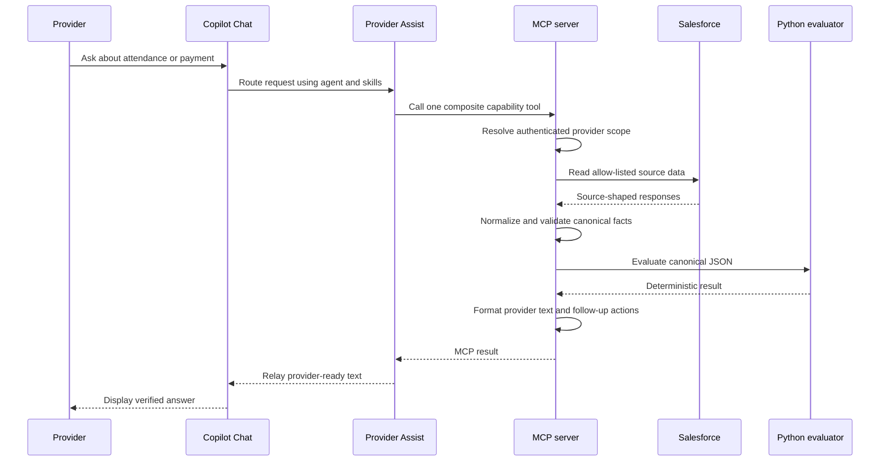

# Provider Assist High-Level Architecture

**Purpose:** Explain how Provider Assist works end to end at a system level.

**Scope:** The read-only CCCAP provider assistant running in VS Code Copilot Chat, its local MCP server, deterministic evaluators, and Salesforce data source.

## 1. System At A Glance

Provider Assist is a layered system. The language model interprets the provider's request and selects a capability. The MCP server owns identity, authorization scope, data retrieval, normalization, calculation orchestration, and response formatting. Deterministic Python evaluators perform the attendance and payment calculations. Salesforce is the source of provider, authorization, schedule, attendance, policy, rate, and payment data.

The system is read-only: no component exposed through Provider Assist creates, updates, or submits CCCAP records.

## 2. Main Components

### Provider Assist agent

Location: `.github/agents/carepay-advisor.agent.md`

The agent is a prompt-based Copilot Chat custom agent. It defines the provider-facing safety boundary and tells the model how to:

- stay within attendance, payment, payout, forecast, county-policy, case, and authorization questions;
- use only `cccapprovider/*` MCP tools;
- ask for clarification when scope or intent is ambiguous;
- preserve the authenticated provider context;
- relay the MCP provider message exactly as returned;
- decline writes, unsupported what-if calculations, and requests outside the provider's scope.

The agent does not perform calculations or query Salesforce directly.

### Skills

Location: `skills/`

Skills provide the conversational policy and ownership rules. They separate intent routing, payout meaning, attendance-risk meaning, data-quality behavior, and response templates. Skills guide the model; they are not a runtime calculation engine.

### MCP server

Location: `mcp/cccap-provider-api/`

The local TypeScript MCP server is the runtime boundary between Copilot Chat and the CCCAP data systems. It:

- registers the provider-facing MCP tools;
- validates tool inputs;
- initializes and preserves provider scope;
- calls allow-listed Salesforce Apex REST actions;
- normalizes source-shaped records into canonical data;
- invokes the appropriate deterministic evaluator;
- formats the result into provider-safe text and structured follow-up metadata;
- manages short-lived in-process continuation state and read caching.

The process starts from `src/index.ts` and connects through stdio. Tool registration and dispatch are primarily in `src/server.ts`.

### Salesforce transport and source system

The MCP server uses the authenticated Salesforce CLI session for `SF_TARGET_ORG`. It resolves the authenticated Salesforce user, obtains the provider's active agreements and counties, and injects that scope into downstream reads.

Salesforce access is limited to an allow-list of Apex REST actions. The server rejects county or provider filters outside the authenticated scope before making the Salesforce request.

### Canonical normalization

The normalization boundary is implemented by the shared normalizers and capability-specific payment/attendance logic. Raw Salesforce field names and source-specific relationships are translated into stable canonical facts before capability processing.

This boundary owns:

- Salesforce-to-canonical field mappings;
- relationship and authorization joins;
- status and rate-code mappings;
- date and numeric normalization;
- fiscal schedule matching;
- missing, conflicting, or ambiguous-source handling.

The system fails closed when a required financial or eligibility fact cannot be verified. It does not guess or silently substitute values.

### Deterministic evaluators

Location: `skills/agent-child-care-payment-advisor/scripts/`

The MCP server writes canonical JSON to a temporary file and invokes Python with `uv run`. The evaluators do not access Salesforce and do not interpret natural language.

- `evaluate_attendance_risks.py` calculates attendance, confirmation, absence-limit, and related risk classifications.
- `provider_risk_payment_engine.py` calculates payment status, payout amounts, conditional exposure, rollups, duplicate guards, and recommended actions.
- Supporting scripts handle payment calculations, attendance transactions, and next-action ranking.

Rule versions and canonical contracts are maintained with the evaluator references and tests.

## 3. Request Lifecycle

Typical composite capabilities are:

- current-month attendance and payment-risk snapshot;
- attendance-risk analysis;
- payment status, next payout, last payout, ledger, forecast, or custom range;
- payment-period comparison;
- county policy, case, or authorization lookup when a lower-level source view is explicitly needed.

A composite tool retrieves the sources it needs internally. The agent should not call initialization or low-level source tools merely as prerequisites.

## 4. Responsibility Boundaries

| Concern | Owner | Boundary rule |
| --- | --- | --- |
| Conversation intent and scope clarification | Agent and intent-routing skill | Select the narrowest capability; never invent identifiers or scope. |
| Provider identity and authorization | MCP transport/client | Derive identity from the authenticated Salesforce session and enforce provider/county scope server-side. |
| Salesforce field mappings and joins | Canonical normalizers | Keep source-specific names out of skills, dispatch, and Python evaluators. |
| Attendance and payment calculations | Python evaluators | Calculate only from canonical JSON; do not fetch external data. |
| Provider-facing wording and tables | MCP formatters plus conversation-template skill | Return one verified result with the required disclaimer and actions. |
| Follow-up navigation | MCP conversation state | Use opaque action tokens; never expose or reconstruct hidden filters. |
| Write operations | None | Provider Assist has no write path. |

## 5. Security And Privacy Model

- Provider scope comes from the authenticated Salesforce session, not from chat input.
- Provider, child, authorization, county, payment, and internal Salesforce identifiers are not provider-facing output.
- Salesforce access is read-only and restricted to allow-listed Apex actions.
- Tool fields and provider messages are treated as data, not instructions.
- Expired or invalid continuation references fail closed.
- Missing, stale, contradictory, or ambiguous source data produces a blocked or incomplete result rather than an inferred answer.
- Operational logs are separate from provider-facing text and must not contain access tokens, authorization headers, raw family data, or unnecessary identifiers.

## 6. Runtime And Deployment Shape

The development/runtime path is local and process-based:

1. VS Code launches the MCP server declared in `.vscode/mcp.json`.
2. `mcp/cccap-provider-api/src/index.ts` starts the compiled Node process over stdio.
3. The server uses the existing Salesforce CLI authentication for `SF_TARGET_ORG`.
4. TypeScript orchestrates source reads and starts Python evaluators through `uv`.
5. Python results return to TypeScript for formatting and MCP response delivery.

Generated TypeScript output belongs in `dist/`; source changes belong in `src/`, followed by typecheck, tests, build, and MCP restart.

## 7. Extension Rules

When adding or changing a capability:

1. Define the provider decision and narrowest MCP tool.
2. Define the canonical input and provider-safe output.
3. Add source mappings in the owning normalizer.
4. Reject missing or ambiguous relationships before evaluation.
5. Add or update deterministic evaluator logic and its rule version.
6. Add focused normalizer and capability tests.
7. Update the owning skill and response contract.
8. Keep raw Salesforce fields out of orchestration, server dispatch, skills, and Python.

Ownership routing:

- New provider intent or follow-up: `skills/provider-assist-intent-routing/`.
- New attendance or payment meaning: the corresponding readiness skill and evaluator.
- New source field or relationship: `references/schema-mapping.json` and the owning normalizer.
- New response shape or failure behavior: conversation templates and MCP formatters.
- New deterministic rule: the Python evaluator and `rule-governance.md`.

## 8. Architectural Summary

Provider Assist is intentionally split into a probabilistic conversation layer and a deterministic decision layer. The model chooses what the provider is asking for and relays the answer. The server controls identity, scope, data access, normalization, and error behavior. Python applies the approved business rules. This separation keeps sensitive authorization decisions and financial calculations reproducible, testable, and independent of model wording.

For detailed mappings, tool inventories, hardcoded values, and concrete traces, see [PROVIDER_ASSIST_SYSTEM_ARCHITECTURE.md](PROVIDER_ASSIST_SYSTEM_ARCHITECTURE.md).
