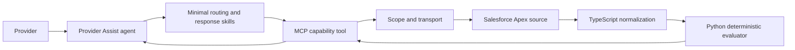
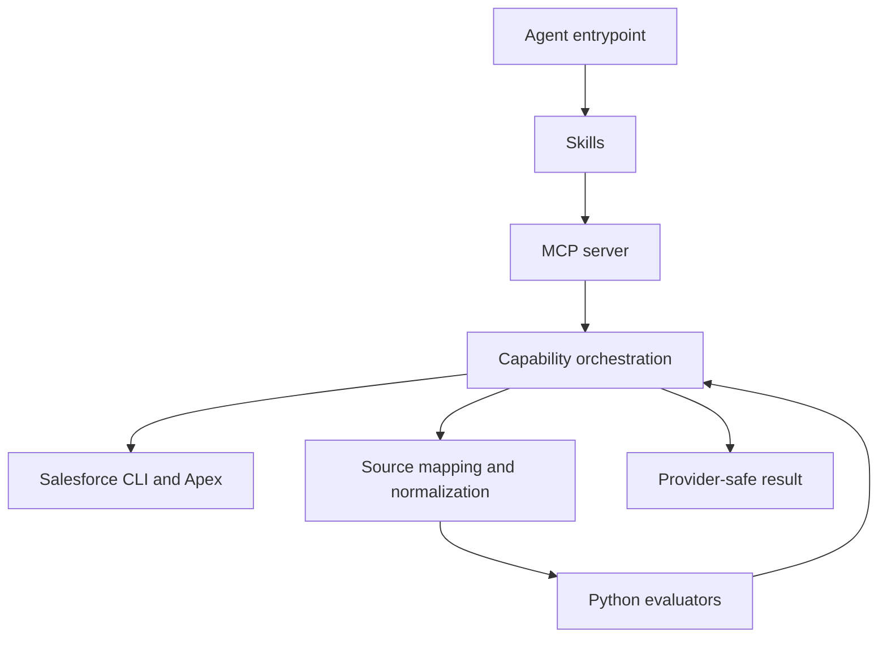

# Architecture Spine: Child Care Agent Final

## Design Paradigm

Provider Assist is a layered, capability-oriented read-only system. A provider request moves through one route and one capability owner:



The agent explains verified results. It does not calculate, join records, choose identity, or write data.

## Invariants & Rules

### AD-1 — One owner per provider capability [ADOPTED]

- **Binds:** attendance risk, parent confirmations, absence limits, payment readiness
- **Prevents:** duplicate fan-out, competing formatters, and inconsistent follow-up behavior
- **Rule:** Each provider-facing action has one composite MCP capability owner. `server.ts` registers and dispatches; domain modules own orchestration and result construction.

### AD-2 — Scope is established outside model input [ADOPTED]

- **Binds:** all provider data access
- **Prevents:** cross-provider access and model-selected identity
- **Rule:** In the current development runtime, MCP resolves the Salesforce CLI authenticated user at startup, initializes provider scope, injects provider and county constraints, and rejects out-of-scope filters. Production identity derivation inside Apex is deferred. Apex remains a secondary authorization guard in both modes.

### AD-3 — Layers have one-way dependencies [ADOPTED]

- **Binds:** agent, skills, MCP, Apex, TypeScript, and Python
- **Prevents:** prompts containing business calculations, Python fetching Salesforce data, and Apex interpreting conversation
- **Rule:** Agent -> skills -> MCP -> source/normalizer -> evaluator. Lower layers never call upward layers.



### AD-4 — TypeScript prepares facts; Python decides deterministic outcomes [ADOPTED]

- **Binds:** attendance, absence, confirmation, payment, and payout calculations
- **Prevents:** duplicated arithmetic, date logic, joins, or rule thresholds in prompts and transport handlers
- **Rule:** TypeScript owns input validation, source mapping, relationship checks, normalization, orchestration, and safe formatting. Python owns counts, dates, classifications, thresholds, and money calculations.

### AD-5 — Canonical contracts fail closed [ADOPTED]

- **Binds:** source-to-evaluator payloads and MCP responses
- **Prevents:** guessed identifiers, stale values, ambiguous joins, and fake successful dashboards
- **Rule:** Canonical inputs and outputs carry stable identifiers, dates, freshness, provenance, capability, readiness, and error status. Missing or ambiguous required data produces a blocked or unavailable result, never an inferred value.

### AD-6 — Apex is source retrieval, not business orchestration [ADOPTED]

- **Binds:** `CHATS_SIT/force-app/main/default/classes/CccapPortalApiV1.cls`
- **Prevents:** duplicated conversation routing and provider-facing calculation logic in Salesforce
- **Rule:** Apex retrieves authoritative Salesforce records and enforces server-side access checks. It does not parse provider language, choose MCP capabilities, or calculate provider-facing risk or payout conclusions.

### AD-7 — Generated artifacts are disposable [ADOPTED]

- **Binds:** MCP `dist` and evaluation reports
- **Prevents:** hand-edited runtime drift and historical fixtures being mistaken for active behavior
- **Rule:** `mcp/cccap-provider-api/dist` is rebuilt from `src`. `skills/reports/eval-runs` is historical output. Runtime changes occur only in source files and are validated before rebuilding.

### AD-8 — Continuations are server-owned projections [ADOPTED]

- **Binds:** attendance and payment follow-ups, action controls, cached-result reuse
- **Prevents:** replayed summaries, model-built filters, and divergent continuation behavior between capabilities
- **Rule:** An opaque action reference resolves inside MCP to a validated capability, normalized scope, filters, focus/view, and pagination projection. The model never owns continuation state or resends cached data.

### AD-9 — Compatible continuations are cache-first [ADOPTED]

- **Binds:** canonical-result reuse, detail pages, refresh behavior, and cache invalidation
- **Prevents:** unnecessary source reads, stale projections, and incorrectly scoped detail
- **Rule:** Serve a continuation from the provider-bound canonical result only when an immutable normalized compatibility key matches provider scope, capability, date scope, filters, focus/view, rule version, freshness policy, projection type, page, and page size. Bypass cache for explicit refresh, expiry, incompatible state, or missing projection data.

### AD-10 — Provider response ownership is text-only [ADOPTED]

- **Binds:** MCP result envelopes and agent/UI relay behavior
- **Prevents:** oversized handoffs, duplicated prose, and competing response sources
- **Rule:** `content[0].text` is the sole provider-facing response channel. `structuredContent` contains only compact status, scope, pagination, and opaque action controls; it never carries canonical rows, child lists, raw identifiers, or duplicated provider prose.

### AD-11 — Continuation resolution fails closed [ADOPTED]

- **Binds:** malformed, expired, unknown, and capability-mismatched action references
- **Prevents:** accidental scope widening and stale-action replay
- **Rule:** When continuation fields are present, an invalid or incompatible reference returns the shared safe error contract and never falls back to model-supplied direct filters.

### AD-12 — Cross-capability actions preserve originating scope [ADOPTED]

- **Binds:** attendance-to-payment and payment-to-attendance actions
- **Prevents:** inherited actions widening provider or county scope
- **Rule:** Cross-capability actions carry only opaque references. MCP resolves the originating bounded scope, and the target capability performs its own authorization and compatibility validation before retrieval.

### AD-13 — Continuation storage is bounded and refreshable [ADOPTED]

- **Binds:** continuation lifecycle, freshness, and process-memory limits
- **Prevents:** unbounded memory, stale reads, and refresh no-ops
- **Rule:** Continuation storage uses provider-scoped process memory with TTL, LRU entry, and byte caps. Explicit refresh bypasses canonical-result reuse and creates a new compatible context.

### AD-14 — Conversation state is a provider-scoped result graph [ADOPTED]

- **Binds:** attendance and payment follow-ups, multi-period payout drill-downs, scoped summaries, and return-to-parent navigation
- **Prevents:** handoff-like context loss, guessed filters, and accidental scope widening
- **Rule:** Every continuation projection records its parent context, current intent, normalized scope, selected service period when applicable, current and parent view, available evidence, freshness, rule version, and scope transition. Narrowing and view deepening may inherit verified state; widening requires explicit provider intent; parent navigation restores the stored parent context.

### AD-15 — Action lifecycle and suppression are server-owned [ADOPTED]

- **Binds:** priority actions, drill-down controls, inherited actions, and follow-up rendering
- **Prevents:** repeated actions, stale cross-capability suggestions, and generic next-step prose
- **Rule:** The server generates action candidates, checks eligibility, deduplicates them against the current result graph, ranks them by severity, impact, and deadline, and tracks `OFFERED`, `SELECTED`, `COMPLETED`, `SUPERSEDED`, `HIDDEN_BY_SCOPE`, and `EXPIRED` states. Previously offered actions are not re-exposed unless explicitly requested and still relevant.

## Consistency Conventions

| Concern | Convention |
| --- | --- |
| Tool names | `cccap_<verb>_<subject>`; composite tools represent provider goals, not raw Salesforce objects. |
| Provider identifiers | Never accept provider identity from model input. Preserve endpoint-specific keys: external numeric provider name for cases; Salesforce provider Id for authorizations, schedules, and fiscal data. |
| Dates and money | ISO dates and explicit decimal/currency handling at the evaluator boundary. |
| Scope | Every composite flow initializes or reuses authenticated provider scope and validates county and related-record relationships. |
| Errors | Provider-safe structured errors include capability, no-result status, and recovery actions; never expose tokens, IDs, raw payloads, stack traces, or CLI output. |
| Cache | Process-memory cache stores provider-bound canonical results and continuation plans; immutable compatibility keys govern reuse, projections are cache-first, and the cache is not durable storage. |
| Source of truth | Runtime source is `.github/agents`, `skills`, `mcp/cccap-provider-api/src`, evaluator scripts, and `CHATS_SIT` Apex. |
| Capability module shape | Each capability exposes one request entrypoint, one canonical input adapter, one evaluator invocation, and one provider-safe result contract. Internal helpers may split mapping and formatting without changing that boundary. |
| Validation ownership | MCP schemas validate request shape; TypeScript normalizers validate source relationships and canonical evaluator inputs; Python validates deterministic rule inputs. The first failing layer returns the shared blocked/error contract. |
| Scope lifecycle | Provider scope is initialized once per MCP process and reused with provider-scoped cache keys; a process restart re-resolves identity. Production revalidation is deferred with identity migration. |

## Stack

| Name | Version |
| --- | --- |
| TypeScript | `7.0.2` |
| MCP server SDK | `@modelcontextprotocol/server` `2.0.0` |
| Zod | `4.5.4` |
| Node type definitions | `26.4.1` |
| Salesforce transport | Salesforce CLI `sf api request rest` |
| Deterministic runtime | Python invoked through `uv` |

## Structural Seed

```text
.github/agents/
  carepay-advisor.agent.md       # selectable Provider Assist entrypoint and tool allowlist
skills/
  agent-child-care-payment-advisor/
    SKILL.md                     # shared agent policy and capability contract
    references/                   # source, integration, rule, and response contracts
    scripts/                     # deterministic evaluators and hermetic tests
  carepay-intent-routing/        # route selection and follow-up scope
  carepay-conversation-templates/ # provider-facing response and failure shape
  carepay-attendance-readiness/  # attendance interpretation guidance
  carepay-payment-readiness/     # payment interpretation guidance
  carepay-data-quality/          # missing, stale, and conflicting data behavior
mcp/cccap-provider-api/
  src/index.ts                   # process startup and authenticated context
  src/server.ts                  # tool registration, dispatch, safe envelope
  src/client.ts                  # scoped Salesforce/Apex client and cache
  src/schemas.ts                 # MCP input validation
  src/sf-cli.ts                  # Salesforce CLI transport
  src/attendance-snapshot.ts     # attendance orchestration and result preparation
  src/attendance-canonical-adapter.ts # attendance source bundle to canonical schedule facts
  src/schedule-normalizer.ts     # shared schedule and transaction normalization
  src/provider-policy.ts         # shared provider policy mappings
  src/payment-orchestration.ts   # payment retrieval and evaluator coordination
  src/payment-canonical-adapter.ts # payment source bundle to canonical evaluator input
  src/payment-schema.ts          # canonical payment contracts and statuses
  src/payment-payload-adapter.ts # payment source normalizers and payload builder
  src/*-normalizer.ts            # source normalization and relationship mapping
CHATS_SIT/force-app/main/default/classes/
  CccapPortalApiV1.cls           # authoritative read-only Apex source boundary
```

## Capability -> Architecture Map

| Capability | Primary owner | Supporting layers |
| --- | --- | --- |
| Greeting/current-month snapshot | `attendance-snapshot.ts` plus snapshot tool registration | agent entrypoint, attendance evaluator, Apex `getProviderData`/`getCountyData`/`getSchedules` |
| Attendance risk and child detail | `attendance-snapshot.ts` plus `attendance-canonical-adapter.ts` and attendance evaluator | attendance skill, schemas, schedule normalizer |
| Parent confirmations | attendance capability with `riskFocus=PARENT_CONFIRMATIONS` | routing skill, attendance evaluator |
| Absence-limit risk and county policy | attendance capability plus county-plan reads | attendance skill, county-plan normalizer, Apex county data |
| Payment readiness and payout analysis | `payment-orchestration.ts` plus `payment-canonical-adapter.ts` and payment evaluator | `payment-schema.ts`, `payment-payload-adapter.ts`, payment skill, fiscal/payment source reads |
| Provider scope and transport | `client.ts`, `sf-cli.ts`, `index.ts` | Apex server-side validation |
| Tool registration and provider-safe output | `server.ts` | schemas and capability handlers |

## File Ownership And Cleanup Plan

| Area | Current owner | Action | Priority |
| --- | --- | --- | --- |
| Agent entrypoint | `.github/agents/carepay-advisor.agent.md` | Keep as the only selectable-agent entrypoint; keep it thin. | Now |
| Agent policy | Main advisor skill plus five supporting skills | Consolidate repeated policy into the main skill, routing skill, and response/failure skill. Keep attendance/payment skills capability-specific. | Next |
| MCP registration | `src/server.ts` | Own registration, dispatch, shared envelopes, and the current provider-safe formatter boundary. Extract formatters only as a focused follow-up with snapshot coverage. | Keep / follow-up |
| MCP shared boundary | `src/index.ts`, `client.ts`, `schemas.ts`, `sf-cli.ts` | Keep as shared infrastructure. Do not place attendance or payment rules here. | Keep |
| Attendance domain | `attendance-snapshot.ts`, `attendance-canonical-adapter.ts`, `schedule-normalizer.ts`, plus attendance evaluator scripts | Keep retrieval, source normalization, and evaluation separate; preserve compatibility exports while callers migrate to the adapter. | Keep / harden |
| Payment domain | `payment-orchestration.ts`, `payment-canonical-adapter.ts`, `payment-schema.ts`, and `payment-payload-adapter.ts` plus payment evaluator | Keep retrieval, normalization, and evaluation separate. Do not activate legacy `calculate_payout.py` for live amounts. | Keep / harden |
| Source mapping contracts | `references/schema-mapping.json`, API and integration contracts | Make these the single mapping reference; remove duplicated field descriptions from prose skills. | Next |
| Apex | `CccapPortalApiV1.cls` | Keep retrieval and server-side validation; document each action's MCP caller. | Next |
| Compiled runtime | `mcp/cccap-provider-api/dist` | Generated from `src`; currently tracked for the local MCP registration, never edit manually, and rebuild after source validation. | Done / clarify |
| Eval reports | `skills/reports/eval-runs` | Treat as historical artifacts; exclude from architecture/runtime searches and clean old copies when storage policy permits. | Later |
| Broad architecture note | `architecture.md` | Keep as a stable pointer to this spine; do not add new behavior rules here. | Done |
| File usage map | `carepay-agent-file-usage.md` | Keep as a short runtime-root pointer; use `skills/ARCHITECTURE.md` for ownership. | Done |
| Handoff log | `CHAT_HANDOFF.md` | Keep as historical migration record; do not use it as current runtime guidance. | Later |

## Operational Scope

### Current Implementation Boundary

- **Transport:** VS Code launches a local stdio MCP process that calls Salesforce through `sf api request rest`.
- **Identity:** MCP resolves the authenticated Salesforce CLI user at process startup.
- **Cache:** Provider-scoped, bounded in-memory cache of canonical results and opaque continuation plans; compatible projections reuse it, while restart clears it.
- **Compute:** One local MCP process serves the authenticated provider context for the session.
- **Data flow:** Read-only; no writes, notifications, background jobs, or scenario mutation.

### Production Decisions Deferred

- Deployment topology and process scaling.
- Apex-side production identity derivation.
- Dev, SIT, staging, and production environment lifecycle.
- Logging, tracing, metrics, alerting, and privacy-safe operational diagnostics.
- Retry and recovery behavior for Salesforce timeouts, CLI failures, and connection loss.
- Python and `uv` version pinning in project configuration.
- Resource limits and concurrency guarantees.

## Deferred

- Physical movement of TypeScript modules into `capabilities/`, `mapping/`, and `transport/` directories. First extract ownership boundaries without changing tool contracts.
- Reduction from five supporting skills to three. Do this only after evaluating whether attendance and payment prompts still need separate guidance.
- Full transaction-level attendance activation until the required source fields and relationships are available live.
- Live provider payout amounts until the canonical payment source contract is complete.
- Durable cache, background jobs, writes, notifications, and scenario mutation.
- MCP envelope alignment and source-read cache parity remain implementation work; they must not weaken the continuation compatibility, refresh, or fail-closed rules above.
- Source-read cache parity and production deployment topology remain implementation concerns; they must not weaken the continuation compatibility, refresh, or fail-closed rules above.
- Result-graph storage, action lifecycle transitions, scoped payment-summary inputs, multi-period payout entry-point integration, incomplete-attendance child-date detail, and live MCP smoke validation remain implementation work; each must preserve AD-5 and AD-8 through AD-15.
