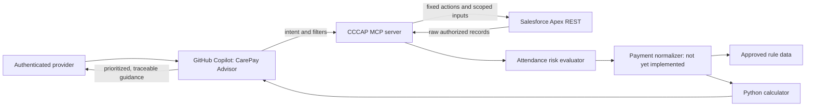
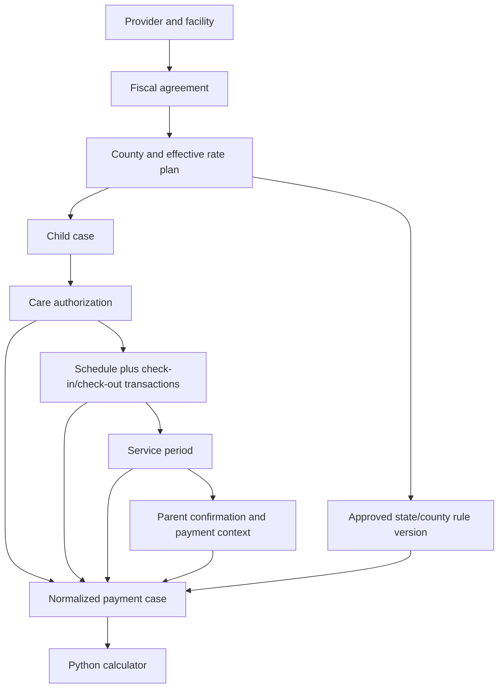

# Copilot Agent and MCP Architecture

## Purpose

This workspace implements CarePay Advisor, a read-only GitHub Copilot agent for authenticated child care providers. It identifies attendance and payment risks, obtains live authorized Salesforce data through MCP, and explains deterministic calculation results.

The pattern is reusable for any decision-support agent that must combine LLM judgment, protected operational data, and exact business rules.

## Design Principle

Assign each responsibility to the layer that can perform it reliably and securely:

| Layer | Owns | Must not own |
| --- | --- | --- |
| GitHub Copilot agent | Understand user intent, choose a narrow tool, request the required data, explain results and uncertainty | Provider identity, record joins, arithmetic, date logic, rule interpretation at runtime, writes |
| MCP server | Authenticate through approved infrastructure, inject scope, validate inputs, enforce authorization boundaries, invoke approved APIs | Business calculations, user-facing financial conclusions, unrestricted API proxying |
| Salesforce/Apex | Authoritative operational records, existing domain query/service logic, server-side access control | LLM prompt interpretation |
| Normalizer | Map raw records into a stable calculation model, validate relationships and provenance | Guess missing data |
| Deterministic calculator | Counts, rule application, money/date calculations, scenario comparisons, portfolio aggregation | Fetching records, making judgment calls |
| Rule data | Versioned, approved policy values and effective dates | Free-form LLM interpretation of source documents |



## What Exists Today

### Copilot Agent

[.github/agents/carepay-advisor.agent.md](.github/agents/carepay-advisor.agent.md) creates the selectable **CarePay Advisor** agent in VS Code. Its frontmatter grants only the dedicated `cccapprovider/*` MCP tools, keeping workspace reads and command execution out of the provider workflow.

The agent loads [skills/agent-child-care-payment-advisor/SKILL.md](skills/agent-child-care-payment-advisor/SKILL.md), which defines its persona, risk priority, calculation boundary, shared failure policy, and routing to specialized skills. Reusable LLM behavior is split into [skills/carepay-conversation-templates/SKILL.md](skills/carepay-conversation-templates/SKILL.md), [skills/carepay-attendance-readiness/SKILL.md](skills/carepay-attendance-readiness/SKILL.md), [skills/carepay-payment-readiness/SKILL.md](skills/carepay-payment-readiness/SKILL.md), and [skills/carepay-data-quality/SKILL.md](skills/carepay-data-quality/SKILL.md). Its main functional commitments are:

- Lead with attendance risks, absence-limit exposure, and parent-confirmation deadlines.
- Label values as expected, conditional, at risk, excluded, or unavailable.
- Remain read-only and never modify provider, attendance, authorization, or payment records.
- Use Python for every deterministic calculation.
- Stop rather than invent a result when source data or mappings are missing.
- If the provider starts with a greeting, relay the deterministic current-month attendance-risk snapshot and offer one or two finding-specific next actions.
- For every other message, resolve one supported intent before fetching data; ask one clarifying question for genuine ambiguity and state the boundary for unsupported requests.
- Refresh only the narrowest source data required when child, county, date, detail, or capability scope changes.

### Salesforce REST API

[CHATS_SIT/force-app/main/default/classes/CccapPortalApiV1.cls](CHATS_SIT/force-app/main/default/classes/CccapPortalApiV1.cls) exposes `POST /services/apexrest/CccapPortalApi/v1/{action}`. The MCP server permits only these actions:

| MCP tool | Apex action | Functional purpose |
| --- | --- | --- |
| `cccap_initialize_provider` | `getProviderData` | Resolve the provider, facility, active fiscal agreements, counties, and closures. Must run first. |
| `cccap_analyze_attendance_risk` | `getCountyData` + `getSchedules` | Analyze facility or child-scoped attendance, confirmation, and absence-limit risk through the shared Python evaluator. |
| `cccap_get_cases` | `getCaseData` | Retrieve scoped cases and children. |
| `cccap_get_authorizations` | `getAuthData` | Retrieve active care authorizations. |
| `cccap_get_county_rate_plans` | `getCountyData` | Retrieve effective absence, holiday, and drop-in policy. |
| `cccap_get_schedules` | `getSchedules` | Retrieve schedule and check-in/check-out data. |
| `cccap_get_service_periods` | `getServicePeriods` | Retrieve current/upcoming service and payment periods. |
| `cccap_get_holidays` | `getHolidayList` | Retrieve holiday dates. |

`getProviderData` returns two provider keys with different downstream purposes. The MCP server retains both: the provider external `Name` is passed only to `getCaseData`, whose `IDN_PROVR__c` filter is numeric and unquoted; the Salesforce provider record `Id` is passed to `getAuthData` and `getSchedules`.

All Apex responses use the envelope `{ isSuccess, errorMessage, data }`.

### Dedicated MCP Server

[mcp/cccap-provider-api](mcp/cccap-provider-api) is a TypeScript stdio server built with `@modelcontextprotocol/server` 2.0.0. It exists because the generic `@salesforce/mcp` data toolset can run SOQL but cannot invoke arbitrary custom Apex REST resources.

The server is registered as `cccapprovider` in [.vscode/mcp.json](.vscode/mcp.json). It uses `sf api request rest` rather than passing a Salesforce bearer token through Node.js. This reuses the user’s existing Salesforce CLI authorization and keeps access tokens out of MCP code, logs, prompts, and tool results.

## Authentication and Authorization

### Development Flow

1. VS Code starts `node mcp/cccap-provider-api/dist/index.js` from the SFDX project directory.
2. `SF_TARGET_ORG` is set to the named SFDX alias `CHATS_SIT`.
3. The MCP server resolves the authenticated Salesforce CLI username to its `User.Id`; no user ID is prompted for, committed, or supplied by the model.
4. The MCP server calls `cccap_initialize_provider`; it injects that resolved user ID into `getProviderData`.
5. The server records the returned provider Salesforce IDs, provider external names, and active county IDs in process memory.
6. Each subsequent provider-specific tool injects its required provider key: external name for cases; Salesforce ID for authorizations and schedules. Requested county IDs are rejected locally unless they belong to the initialized provider scope.
7. The server runs `sf api request rest` with JSON on stdin. Salesforce CLI uses its existing authenticated session to call Apex.

The provider user ID is an authorization identifier, so it must not be logged. Production should derive identity in Apex rather than accepting it in a REST body.

### Production Target

For a Salesforce-embedded experience, derive identity inside Salesforce from the authenticated session, for example `UserInfo.getUserId()`, rather than accepting `userId` in an HTTP body. The Apex REST resource currently accepts `userId` and uses `WITH SYSTEM_MODE` in places, so production authorization must be enforced in Apex and in the MCP/API gateway, not trusted to the model.

Use least privilege throughout:

- Expose only purpose-built read tools, not generic HTTP or unrestricted SOQL.
- Bind each request to an authenticated provider/facility server-side.
- Check county, fiscal agreement, child, authorization, and service-period relationships server-side.
- Do not return more child/family data than the specific tool requires.
- Do not log access tokens, authorization headers, provider IDs, child data, or raw family data.

## Data Normalization

Raw Salesforce and external schedule fields are not a stable calculation API. The planned normalizer creates one **payment case** for each child, county fiscal agreement, and service period.



The canonical input contract is documented in [skills/agent-child-care-payment-advisor/references/integration-contract.md](skills/agent-child-care-payment-advisor/references/integration-contract.md), and current API response gaps are tracked in [skills/agent-child-care-payment-advisor/references/api-response-contract.json](skills/agent-child-care-payment-advisor/references/api-response-contract.json). At minimum, each case requires:

- Stable source identifiers for provider, facility, county, agreement, child, authorization, service period, and rate plan.
- Explicit `as_of_date`, retrieval timestamp, source system, rule version, and rule effective dates.
- Validated authorized, attended, and absent day counts derived from schedule/transaction records.
- Effective absence limit, rate, copay, adjustments, and holiday policy.
- Parent-confirmation status, deadline, and confirmation timestamp.
- Payment processing/release date where an upcoming-payout statement is required.

The normalizer must reject or flag incomplete check-in/check-out pairs, overlapping schedules, missing effective rate plans, mismatched authorization periods, missing confirmation data, stale data, and ambiguous record relationships. It must never infer missing values.

**Current status:** the MCP tools return raw authorized data and the Python calculator accepts normalized JSON. A first-stage attendance evaluator now consumes current-month schedules and county rate plans; the broader normalizer that maps live responses to payment cases is not implemented yet. This is the next functional development milestone.

## Conversation Orchestration

The agent has two entry paths:

1. A greeting-only message calls `cccap_get_current_month_risk_snapshot`, which returns the holistic facility snapshot and a deterministic provider-facing message. The agent relays that message and offers one conversational next step.
2. Any other message uses the main skill routing contract to identify one primary capability, requested subject, date scope, county scope, child names, and detail level; then it loads the conversation-template skill plus the relevant attendance, payment, or data-quality skill before making the narrowest required source calls.

The agent may interpret language, choose a supported route, explain results, and ask one clarifying question. It must not join records, count days, classify attendance, compare dates, apply policy thresholds, calculate money, aggregate children, or run scenarios in model reasoning. Those operations belong to shared Python analysis modules invoked behind narrow MCP routes.

Session context is reusable only while the capability and all scope dimensions are unchanged and the source remains adequate. A child-specific request never uses a facility aggregate as its answer; a changed child, county, date, detail level, or capability triggers a fresh narrow retrieval.

Provider-facing responses are conversational rather than workflow-like: begin with a brief human sentence, use compact Markdown tables for comparable facts, child lists, risk findings, payment components, and dates, and end with a visually separate `Next actions` or `Follow-up` section. The conversation-template skill owns reusable response shapes and prohibits fallback dashboards with placeholder values. The MCP snapshot renderer supplies the first-load structure deterministically so the model does not collapse the first response into a generic paragraph.

## Risk-First Snapshot

When the provider starts with a greeting, the agent silently performs this bounded sequence:

1. Call `cccap_get_current_month_risk_snapshot` with no model-supplied identifiers or filters.
2. Inside the MCP server, initialize the authenticated provider with `THIS_MONTH`, retrieve only authorized current-month county rate plans and schedules, construct the evaluator input, and run [evaluate_attendance_risks.py](skills/agent-child-care-payment-advisor/scripts/evaluate_attendance_risks.py).
3. Delete the temporary evaluator input before responding to Copilot.
4. Return provider display name, facility name, the compact evaluator verdict, and the deterministic `providerMessage`. Greet the provider by display name and facility name; they are separate fields and must never be substituted for one another.

This aggregation moves file creation and Python execution out of the Copilot agent. The provider sees one read-only MCP call rather than multiple raw-data calls and a command approval for evaluator execution. The same pattern should be reused for child detail, attendance exceptions, absence-limit risk, and payment analysis: narrow source tools retrieve authorized records, then shared Python modules perform deterministic analysis and return a provider-safe result.

The evaluator groups daily schedule records by child and applies the following deterministic rules:

- A day with zero check-ins and zero check-outs on or before $asOfDate - 9$ days is a probable absence after the confirmation window.
- The same condition inside the nine-day window is pending confirmation, not an absence.
- A day with only one of check-in/check-out is incomplete attendance.
- An absence limit is evaluated only when that child's county and quality tier map to an effective county rate plan. Otherwise, the output reports that the absence limit is unavailable rather than guessing across counties.

The evaluator produces two separate snapshot sections from the same current-month schedule dataset:

- **Today's snapshot:** unique children scheduled and checked in where service date equals `as_of_date`.
- **Monthly payment-readiness risks:** probable absence days older than the nine-day window, pending confirmations within that window, incomplete attendance, absence-risk children, and attendance-concern children across all records through `as_of_date`.

The evaluator is deliberately not a payment calculator. It reports attendance risk counts and child-level risk codes; payments, authorization overages, parent fees, holidays, and service-period payout timing remain on-demand flows until complete payment-case normalization exists.

## Deterministic Calculation

[skills/agent-child-care-payment-advisor/scripts/calculate_payout.py](skills/agent-child-care-payment-advisor/scripts/calculate_payout.py) uses Python `Decimal` and explicit ISO dates. It currently calculates:

- Reimbursable attendance and absence days.
- Non-reimbursable excess absences.
- Net daily rate after parent copay.
- Calculated and expected payout.
- Amount already excluded versus amount still at risk.
- Expected, conditional, or disputed confirmation status.
- Facility portfolio totals across child-level cases.

The approved current policy is:

- Confirmation completed by the deadline: payout is `EXPECTED`.
- Confirmation pending on or before its deadline: payout is `CONDITIONAL`; the calculated amount is shown as at risk.
- Confirmation missing after the deadline, or completed after the deadline: payout is `DISPUTED`; expected payout is $0 and the calculated amount remains at risk.

Colorado source documents and county rate plans must be converted to versioned, cited, business/compliance-approved structured rule data. See [skills/agent-child-care-payment-advisor/references/rule-governance.md](skills/agent-child-care-payment-advisor/references/rule-governance.md). The LLM must not reread and interpret rule PDFs for each provider request.

### Transaction-Level Attendance Rules

[skills/agent-child-care-payment-advisor/scripts/analyze_attendance_transactions.py](skills/agent-child-care-payment-advisor/scripts/analyze_attendance_transactions.py) implements the schedule-validity, authorized-hours, transaction-validity/type, attended-hours, drop-in, anomaly, and facility-scoped county rules documented in [skills/agent-child-care-payment-advisor/references/attendance-transaction-rules.md](skills/agent-child-care-payment-advisor/references/attendance-transaction-rules.md), with hermetic tests for every implemented rule group. It is a script-level capability today: `getSchedules` does not yet return the per-transaction fields (type, sub-type, status, result, historical flag) it needs, so it is not yet reachable through a live MCP tool. Rules requiring cross-provider county-wide visibility (the county's total drop-in pool, county-wide summaries) and a few internally contradictory or underspecified rows (overnight midnight-splitting, orphan-transaction matching, the 36-month enrollment-absence exception) are intentionally not encoded; both the reference document and the module's `UNIMPLEMENTED_RULES` list name each one and why.

## Functional Request Flow

For “Show my payment risk this month,” the intended flow is:

1. CarePay Advisor recognizes a payment-risk request and calls `cccap_initialize_provider` for `THIS_MONTH`.
2. It retrieves rate plans, relevant cases, authorizations, schedules, service periods, and holidays only where needed.
3. The normalizer validates and produces payment cases.
4. Python evaluates every payment case and aggregates facility totals.
5. The agent explains the result in this order: urgent attendance/confirmation risks, deadline, affected amount, expected/conditional/excluded totals, recovery actions, confidence and source freshness.

For an upcoming payout request, it obtains the next service period with `paymentAfter: "TODAY"` and `limitOne: true`. For a what-if request, it retains all live inputs, changes only the explicitly requested scenario input, reruns Python, and labels the result as a scenario.

## Technical Delivery Process

### Build and Run

From [mcp/cccap-provider-api](mcp/cccap-provider-api):

```powershell
npm install
npm test
npm run typecheck
npm run build
npm run protocol
```

Then in VS Code run **MCP: Reset Cached Tools**, restart `cccapprovider` from **MCP: List Servers**, select **CarePay Advisor**, and make a provider-payment request.

### Tests and Validation Completed

- Ten hermetic TypeScript unit tests cover request schema validation, split provider identifiers, user/provider injection, county scope denial, and sanitized Salesforce CLI failures.
- Strict TypeScript typecheck passes.
- An MCP protocol test establishes a stdio connection and asserts that exactly nine tools are advertised.
- A live initialization smoke test against `CHATS_SIT` succeeded after provider mapping correction, returning aggregate counts only.
- The Python calculator has tests for absence-cap behavior, confirmation status, deadline handling, and portfolio aggregation.
- The attendance evaluator has tests for the nine-day confirmation cutoff, absence-limit evaluation, and unmapped county/tier behavior.

### Required Next Tests

- Contract fixtures for each Apex tool response.
- Normalizer tests for every source-to-payment-case relationship and failure condition.
- Rule-version and effective-date boundary tests.
- Payment-calendar, holiday, adjustment, and EFT timing tests.
- Negative authorization tests in Salesforce, including attempts to access another provider, county, child, or case.
- End-to-end tests from a Copilot request through MCP, normalizer, calculator, and provider-safe response.

## Reuse for Another Agent

To build this pattern for another domain, retain the architecture and replace the domain contract:

1. Define the user, required decision, and one outcome the agent must get right.
2. Classify operations: LLM judgment versus deterministic logic. Push the latter into tested code.
3. Define a small set of domain-specific MCP tools. Never expose arbitrary HTTP just to make integration easier.
4. Make an initialization tool establish the authenticated principal and permitted scope before any downstream access.
5. Validate every tool input with schemas and enforce scope again in the server/API.
6. Define one normalized model independent of vendor record names.
7. Put business rules into approved versioned data and deterministic code.
8. Give the agent a concise tool-routing policy and a clear degraded-mode behavior.
9. Test each boundary independently, then validate the full protocol and one redacted live smoke test.

This produces agents that are useful without asking the model to impersonate a calculator, database join engine, policy repository, or authorization system.

## GitHub Copilot Customization Boundaries

Keep each customization type narrow so a future agent is discoverable, maintainable, and does not load unnecessary context.

| Artifact | Responsibility | CarePay location |
| --- | --- | --- |
| Custom agent (`*.agent.md`) | Agent-picker identity, trigger description, tool allowlist, model/subagent restrictions, and one skill-loading directive | [.github/agents/carepay-advisor.agent.md](.github/agents/carepay-advisor.agent.md) |
| Skill (`SKILL.md`, scripts, references) | Repeatable domain workflow, user-facing behavior, intent-to-tool routing, script invocation, decision rules, failure behavior, and domain assets | [skills/agent-child-care-payment-advisor](skills/agent-child-care-payment-advisor) |
| Workspace instructions (`copilot-instructions.md`) | Cross-cutting engineering/security rules that apply regardless of which agent is selected | [.github/copilot-instructions.md](.github/copilot-instructions.md) |
| MCP server | Typed tool contracts, authentication, provider scope enforcement, API calls, and deterministic integration transforms | [mcp/cccap-provider-api](mcp/cccap-provider-api) |

The agent file must not duplicate the skill's workflow. The skill must not own global repository policies. Workspace instructions must not contain provider conversation scripts or tool-routing details, because they would consume context for unrelated tasks.

For a new Copilot-native package, prefer `.github/skills/<skill-name>/` as the skill location. CarePay keeps its existing `skills/agent-child-care-payment-advisor/` bundle because it was generated by BMad; the custom agent explicitly loads it. Migrate it to `.github/skills/` only as one deliberate, tested move that updates all script and reference paths together.